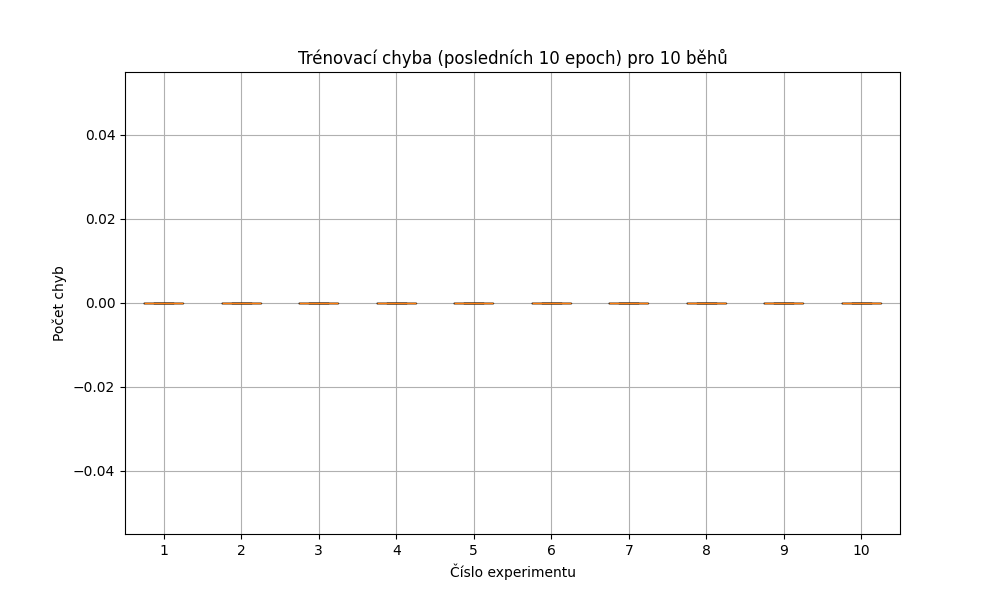

# Záznam do deníku – Perceptron a Wine dataset

## Popis úlohy
Cílem experimentu bylo implementovat jednoduchý perceptron pro binární klasifikaci dat z datasetu **Wine**. Úkolem bylo rozlišit třídu 1 od ostatních tříd (spojených do třídy 0). Dataset obsahuje 178 vzorků s 13 příznaky.

## Parametry trénování
- **Dataset**: [Wine (UCI)](https://archive.ics.uci.edu/dataset/186/wine)
- **Počet trénování**: 10
- **Počet epoch**: 100
- **Learning rate**: 0.1
- **Aktivační funkce**: Kroková funkce  `step function` (0/1)
- **Rozdělení dat**: `80 %` trénink, `20 %` test (`142` vzorků trénink, `36` vzorků test)
- **Normalizace vstupů**: `StandardScaler()`

## Výsledky experimentu
- **Nejlepší model**: Běh č. 0
- **Přesnost na testovací množině**: 100.0 %
- **Váhy nejlepšího modelu**:
```python
[-0.80845798 -0.62797949 -0.34409233 -0.95182429  0.6040847   0.15578245
 -0.16055299  0.36387226  0.51721521 -0.01992135 -1.23524501  0.50447961
  0.30845586 -1.54322013]
```


### Boxplot trénovacích chyb (posledních 10 epoch)

