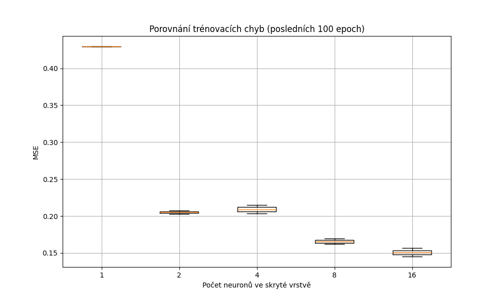
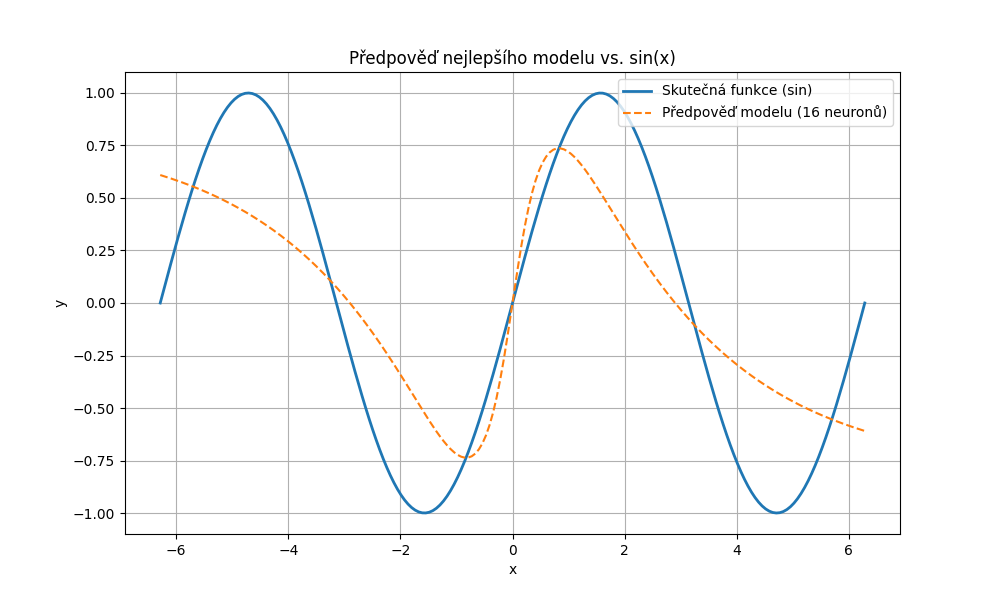

# Záznam do deníku – Trénování neuronové sítě na funkci sin(x)

## Popis úlohy
Cílem experimentu bylo natrénovat jednoduchou plně propojenou neuronovou síť pro aproximaci matematické funkce **sin(x)**. Síť měla jednu skrytou vrstvu s proměnlivým počtem neuronů a lineární výstupní vrstvu.

## Parametry trénování
- **Vstupní vrstva**: 1 neuron
- **Výstupní vrstva**: 1 neuron
- **Aktivační funkce**: tanh (skrytá vrstva)
- **Počet epoch**: 1000
- **Learning rate**: 0.01
- **Ztrátová funkce**: Mean Squared Error (MSE)
- **Trénovací data**: 200 bodů rovnoměrně rozložených na intervalu [-2π, 2π]

## Experiment: Počet neuronů ve skryté vrstvě
Provedl jsem experiment s následujícími velikostmi skryté vrstvy:
[1, 2, 4, 8, 16]
Pro každý model jsem zaznamenal průběh trénovací chyby a finální MSE.

## Výsledky
### Trénovací chyba (MSE) – posledních 100 epoch


### Nejlepší model
- **Počet neuronů ve skryté vrstvě**: 16
- **Finální trénovací chyba (MSE)**: 0.1453

### Váhy nejlepšího modelu
```
W1: [[ 0.25797942 -1.2428223  -0.65197181  0.81302572 -1.21971373  0.9798235
  -0.63404961 -0.08480807  1.07518449  0.98737629 -2.68164794  0.23683683
   1.38847999 -0.23614536  0.44881517 -0.75467535]]
b1: [[ 1.80524883e-17 -2.51850063e-18  1.55099354e-18 -1.64262463e-19
   6.13830855e-19  1.05448359e-19 -3.54602357e-18  9.05733389e-19
  -3.47142647e-19 -1.03491442e-18 -5.65062895e-19  2.54833451e-17
   1.25057482e-18 -1.41190182e-17  4.53453042e-18  7.75822552e-19]]
W2: [[-0.56251877]
 [-0.70247746]
 [-0.03471668]
 [ 0.03202335]
 [-0.08219007]
 [ 0.26530912]
 [ 0.47226626]
 [ 0.09557097]
 [ 0.09228562]
 [-0.22619842]
 [-0.34284569]
 [-0.73012681]
 [ 0.37355677]
 [ 0.4917675 ]
 [-0.22788425]
 [-0.05942307]]
b2: [[2.78802589e-17]]
```

### Porovnání výstupu nejlepšího modelu s funkcí sin(x)

