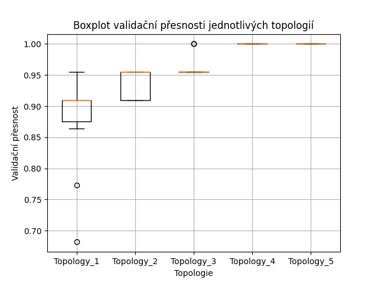

# Záznam do deníku – Tvorba FFNN pomocí Keras (sekvenční model)

## Zadání
- Seznámení se s tvorbou dopředné neuronové sítě (Feedforward Neural Network – FFNN) pomocí sekvenčního modelu v Keras.
- Návrh více topologií a jejich vyhodnocení na klasifikační úloze.
- Experimentování se stabilitou trénování pomocí více běhů.
- Vyhodnocení nejlepšího modelu.

## Úloha
- Klasifikační úloha rozpoznávání květin pomocí datasetu Iris.
- Klasifikace vzorku do jedné ze tří tříd na základě čtyř numerických atributů.

## Příprava dat
- Dataset Iris byl normalizován pomocí `StandardScaler`.
- Cílové hodnoty byly zakódovány pomocí `LabelBinarizer` (one-hot encoding).
- Data byla rozdělena na:
  - 70 % trénovací sada
  - 15 % validační sada
  - 15 % testovací sada

## Topologie modelů
| Topologie | Popis |
|-----------|-------|
| Topology_1 | 10 neuronů → výstupní vrstva |
| Topology_2 | 20 neuronů → 10 neuronů → výstupní vrstva |
| Topology_3 | 40 neuronů → 20 neuronů → 10 neuronů → výstupní vrstva |
| Topology_4 | 80 neuronů → 40 neuronů → 20 neuronů → 10 neuronů → výstupní vrstva |
| Topology_5 | 160 neuronů → 80 neuronů → 40 neuronů → 20 neuronů → 10 neuronů → výstupní vrstva |

- Každá architektura byla trénována 10krát pro stabilizaci vlivu náhodné inicializace vah.

## Výsledky
- Pro každou topologii byla zaznamenána validační přesnost.
- Výsledky jsou zobrazeny pomocí boxplotu:

## Nejlepší model
- Nejlepší výsledky dosáhla topologie **Topology_4**.
- Nejlepší model byl natrénován na trénovacích datech a ověřen na testovací sadě.

**Výsledky na testovacích datech:**
- **Test Loss:** 0.0411
- **Test Accuracy:** 1.0000

## Závěr
- Složitější topologie s více vrstvami dosahují lepších výsledků na této klasifikační úloze.
- Testovací přesnost 1.0000 ukazuje velmi dobré naučení modelu.
- Pro menší dataset Iris byla dostačující i jednoduchá FFNN architektura.
- Pro trénink byl použit CPU, což bylo pro rozsah úlohy dostatečné.
