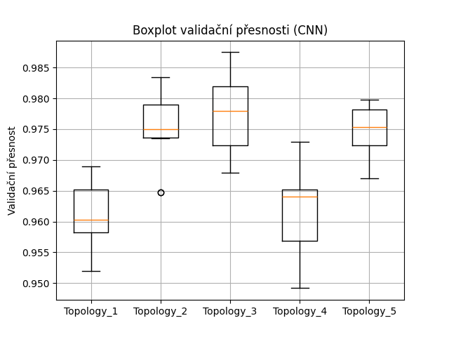
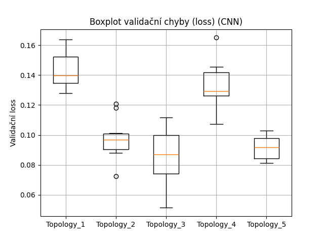
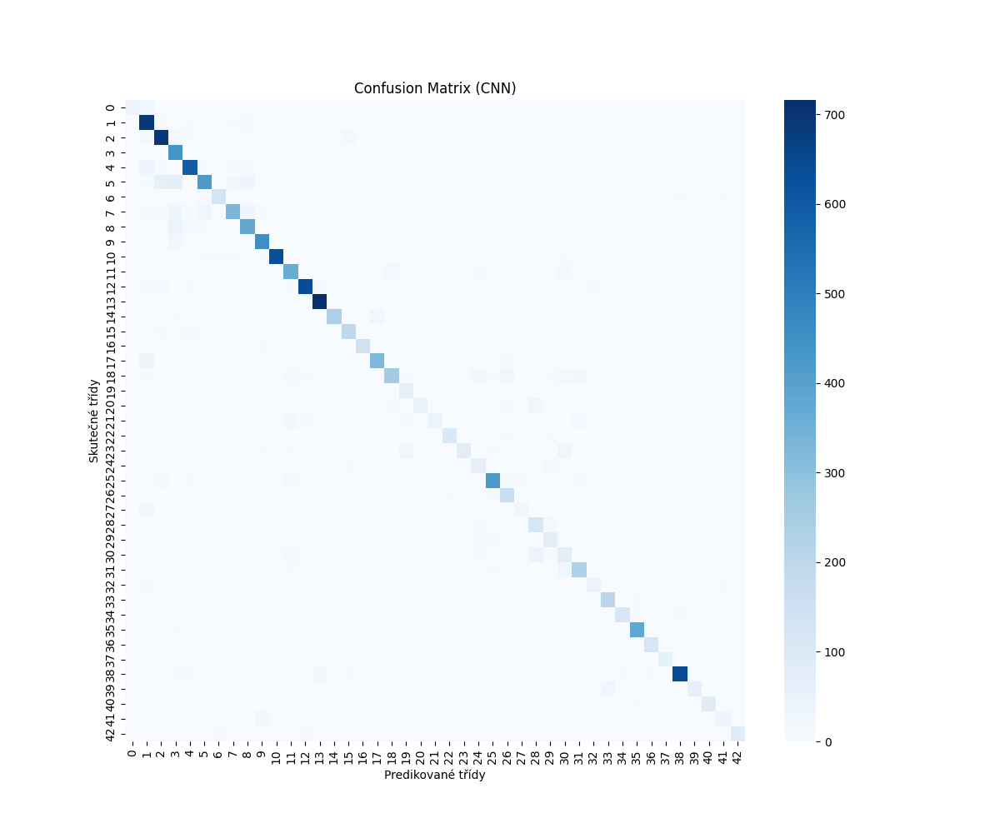

# Experiment 06 – Klasifikace dopravních značek pomocí CNN (PyTorch)

## Cíl
- Navrhnout a otestovat různé architektury konvolučních neuronových sítí (CNN) pro klasifikaci dopravních značek z datasetu GTSRB.
- Porovnat jejich výkon a vybrat nejefektivnější model.

## Použité nástroje a knihovny
- PyTorch 2.4 (nebo novější s CUDA podporou)
- torchvision, sklearn, matplotlib, seaborn
- Dataset: GTSRB (German Traffic Sign Recognition Benchmark)

## Parametry experimentu
- Počet CNN architektur: 5
- Počet tréninků pro každou architekturu: 10 (pro vyrovnání náhodnosti)
- Epochs: 5
- Batch size: 64
- Rozměr vstupu: 32x32 RGB
- Optimalizátor: Adam (LR = 0.0008)
- Datum a čas: 18:07:49 Центральная Европа (лето) on Wednesday, May 28, 2025

## Architektury CNN
Každá topologie byla definována jako seznam konvolučních vrstev (filtry a velikost kernelu):

1. [(16, 3)]
2. [(32, 5), (16, 3)]
3. [(64, 3), (32, 5)]
4. [(32, 3), (64, 5), (32, 3)]
5. [(64, 5), (64, 3), (32, 5)]

## Boxploty
Výsledky trénování 10 běhů pro každou topologii byly zaznamenány a zobrazeny v boxplot grafech:

* **Validační přesnost:**

* **Validační ztráta:**

## Nejlepší model
* **Topologie:** [(64, 3), (32, 5)]
* Průměrná přesnost: 97.74%
* Průměrná ztráta: 0.0858
Model byl natrénován znovu a vyhodnocen na testovacích datech.

## Výsledky na testovacích datech

| Metrika | Výsledek |
| -------: | -------: |
| Accuracy | 87% |

### Klasifikační report
* `macro avg`: precision 0.86, recall 0.82, f1-score 0.83
* `weighted avg`: precision 0.88, recall 0.87, f1-score 0.87

### Pozorování
* Model dosahuje vysoké přesnosti, zejména u častых tříd.
* Zlepšení oproti předchozím experimentům díky většímu počtu epoch a optimalizované topologii.
* Některé méně zastoupené třídy (např. třída 1 nebo 35) vykazují nižší přesnost.

### Confusion Matrix

## Shrnutí
* CNN sítě nadále převyšují jednoduché FFNN v klasifikaci obrazových dat.
* Větší počet epoch a upravené architektury vedly k lepším výsledkům.
* Pro GTSRB se jako nejlepší ukázala středně hluboká síť [(64, 3), (32, 5)].
* Experiment proběhl úspěšně a všechna data byla správně uložena.
